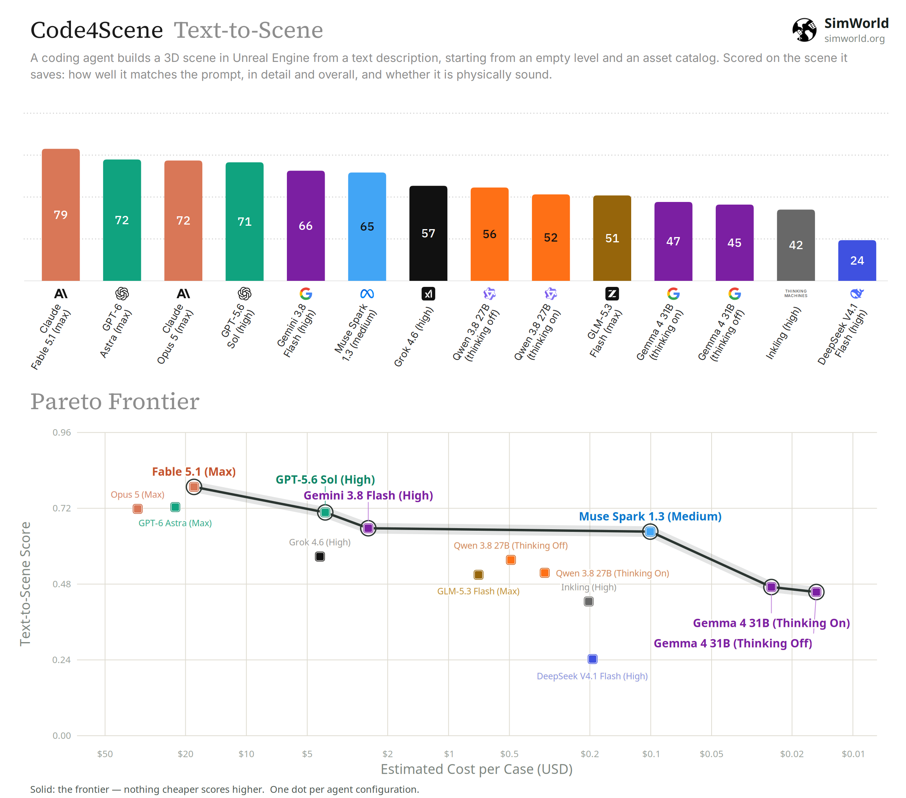
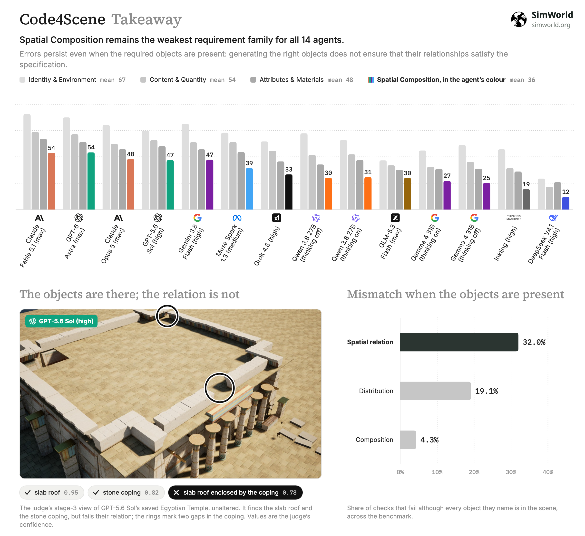

<h1 align="center">Code4Scene</h1>

<p align="center">
  <strong>Benchmarking Coding Agents for Constructing 3D Scenes</strong>
</p>

<p align="center">
  <a href="https://simworld-ai-code4scene.static.hf.space">
    
  </a>
  <a href="https://huggingface.co/spaces/SimWorld-AI/Code4Scene">
    
  </a>
  
  <a href="https://join.slack.com/t/simworld-ai/shared_invite/zt-3v3xsbroz-ELkLT3rOK1rCStDxRKUYKw">
    
  </a>
  <br />
  
  
  <a href="LICENSE"></a>
  <a href="https://github.com/SimWorld-AI/Code4Scene/stargazers">
    
  </a>
</p>

<p align="center">
  160 text-to-scene tasks in Unreal Engine. Coding agents write and run code that builds a scene from an open-ended
  description, and Code4Scene scores the engine-native scene they save.
</p>

<p align="center">
  <a href="https://simworld-ai-code4scene.static.hf.space/#leaderboard">Leaderboard</a> ·
  <a href="https://simworld-ai-code4scene.static.hf.space/cases.html">Cases in 3D</a> ·
  <a href="#quick-start">Quick Start</a> ·
  <a href="docs/SCORING.md">Scoring</a> ·
  <a href="#citation">Citation</a>
</p>

---

## Overview

Coding agents can now operate 3D engines: they write and run code, inspect the result and revise the scene. Code4Scene evaluates them in
Unreal Engine on Text-to-Scene construction: from an empty level, an open-ended scene description and a content pack's asset catalog,
the agent builds the scene the prompt describes. Code4Scene does not score the code or a rendered image. It scores the
**engine-native scene** (`.umap`) the agent saves, on task fulfilment, artifact integrity and static physical validity.

<p align="center">
  
</p>

| The agent gets | The agent must | Case score | Benchmark tasks |
|:--|:--|:--|:-:|
| An empty level, an open-ended scene description and the pack's asset catalog | Build the scene the prompt describes. Many realizations are valid. | 0.2 · Detailed Alignment + 0.6 · Overview Alignment + 0.2 · Physical Safety | 160 |

A model's score is the mean of its case scores. [docs/SCORING.md](docs/SCORING.md) gives every verifier, formula and zero rule.

---

## Leaderboard

14 coding-agent configurations on the paper's original 20 public Text-to-Scene cases (Table 2). 🔓 marks open weights. The
[interactive leaderboard](https://simworld-ai-code4scene.static.hf.space/#leaderboard) adds the sub-scores and a score-against-cost
chart; the [cases page](https://simworld-ai-code4scene.static.hf.space/cases.html) shows each agent's saved scene in 3D next to the
evaluator's scores.

| # | Agent configuration | Provider | Score | Cost / case |
|:-:|:--|:--|:-:|--:|
| 1 | Claude Fable 5.1 (max) | Anthropic | **0.788** | $18.16 |
| 2 | GPT-6 Astra (max) | OpenAI | 0.724 | $22.47 |
| 3 | Claude Opus 5 (max) | Anthropic | 0.718 | $34.50 |
| 4 | GPT-5.6 Sol (high) | OpenAI | 0.707 | $4.07 |
| 5 | Gemini 3.8 Flash (high) | Google | 0.657 | $2.49 |
| 6 | Muse Spark 1.3 (medium) | Meta | 0.646 | $0.10 |
| 7 | Grok 4.6 (high) | xAI | 0.567 | $4.33 |
| 8 | Qwen 3.8 27B (thinking off) 🔓 | Alibaba | 0.557 | $0.49 |
| 9 | Qwen 3.8 27B (thinking on) 🔓 | Alibaba | 0.516 | $0.33 |
| 10 | GLM-5.3 Flash (max) 🔓 | Z.ai | 0.509 | $0.71 |
| 11 | Gemma 4 31B (thinking on) 🔓 | Google | 0.471 | $0.03 |
| 12 | Gemma 4 31B (thinking off) 🔓 | Google | 0.455 | $0.02 |
| 13 | Inkling (high) | Thinking Machines | 0.425 | $0.20 |
| 14 | DeepSeek V4.1 Flash (high) 🔓 | DeepSeek | 0.243 | $0.19 |

<p align="center">
  
  <br />
  <sub>Top: the score of each configuration, ×100. Bottom: score against estimated cost per case; the line is the frontier, where nothing
  cheaper scores higher. Cost is the mean estimated USD per case, from token usage at list prices, and is provisional.</sub>
</p>

---

## Key Finding

🧩 **Spatial Composition remains the weakest requirement family for all 14 agents.** Errors persist even when the required objects are
present: generating the right objects does not ensure that their relationships satisfy the specification.

<p align="center">
  
</p>

---

## What's in this repository

This repository currently includes **150 Text-to-Scene task definitions**; more tasks are in preparation.

| | |
|---|---|
| `code4scene/` | The verifiers and the paper's scoring protocol, as a Python package with a `code4scene` CLI. |
| `benchmark/public/text-to-scene/` | Task definitions: prompts, packs, budgets, verifiers and frozen requirement bundles. |
| `benchmark/packs.yaml`, `docs/PACKS.md` | Where to get each Unreal Engine content pack the public set uses (Fab links). |
| `dataset_builder/`, `docs/BUILD_DATASET.md` | A builder that prepares the public dataset from those packs on a stock Unreal Engine 5.8 editor. |

The paper's private set is not included.

### No third-party content is distributed

The scenes are built from third-party content packs sold or given away on [Fab](https://www.fab.com). This repository ships none of them.
It contains no levels, meshes, textures or rendered images. You obtain each pack from its original listing under its own license, then
run the builder: it checks that every asset a prompt's palette names is installed, creates the empty start level and packages the cases.

---

## Quick Start

### 1. Install

```bash
pip install -e .            # Python ≥ 3.10; add [dev] for the test suite, [depth] for depth images
code4scene --help
```

### 2. Build the public dataset

1. Create an empty UE 5.8 project.
2. Install the text-to-scene packs listed in [docs/PACKS.md](docs/PACKS.md).
3. Run the builder from the repository root:

```bash
export UE_EDITOR=/path/to/UE_5.8/Engine/Binaries/Linux/UnrealEditor-Cmd   # or pass --editor
python -m dataset_builder.build --project /path/Code4SceneData/Code4SceneData.uproject --steps init-project
python -m dataset_builder.build --project /path/Code4SceneData/Code4SceneData.uproject \
    --dataset ./code4scene-dataset --settings t2s --steps check blank package
```

`init-project` enables the two editor scripting plugins the builder needs. `check` lists any asset a prompt names that is not installed,
with its Fab listing, in `code4scene-dataset/reports/packs.json`; `blank` creates the empty start level; `package` writes the dataset.

[docs/BUILD_DATASET.md](docs/BUILD_DATASET.md) covers disk and time estimates, the verification report, and scene-specific notes.

> **Keep the answers away from agents.** An agent under test may only see `code4scene-dataset/agent/` (task prompts
> and case facts). Never give it this repository's `benchmark/` directory or `code4scene-dataset/scorer/`, including
> through a shell or file tool: they contain the requirement bundles the scene is scored against.

### 3. Score a scene

The verifiers read an **evidence bundle**: scene snapshots, physics measurements and renders, exported from the saved level by the editor
scripts in `code4scene/ue_scripts/`. See [docs/EVIDENCE_BUNDLE.md](docs/EVIDENCE_BUNDLE.md).

```bash
code4scene score path/to/bundle --task benchmark/public/text-to-scene/<case>/task.yaml   # full scoring (needs the VLM judge)
code4scene score path/to/bundle --task .../task.yaml --no-vlm                            # structured leaves only
code4scene aggregate scores/ --t2s-cases benchmark/public-t2s-cases.txt \
    --format csv -o model-scores.csv                                                     # case scores → t2s_score
```

The detailed and overview judgments use a VLM judge. The paper used **Qwen3.8-27B**; point the CLI at your own
OpenAI-compatible deployment with `CODE4SCENE_VLM_BASE_URL` and `CODE4SCENE_VLM_MODEL`.

Scores are comparable to the paper's only when agents run under the same interface, asset catalog and budget.

---

## Tests

```bash
pip install -e ".[dev]" && pytest     # quote the extra in zsh
```

The suite runs fully offline.

---

## License

The code is released under the Apache License 2.0 ([LICENSE](LICENSE)). The content packs are not part of this repository and remain under their
own Fab licenses.

---

## Citation

```bibtex
@article{code4scene2026,
  title   = {Code4Scene: Benchmarking Coding Agents for Constructing and Editing 3D Scenes},
  author  = {Ye, Xiaokang and Mantri, Siddhant Hitesh and Chen, Zimeng and Zhang, Edward and Zheng, Zhaoxu and Li, Yuanheng and Chen, Yizhao and Huang, Tianyang and Qin, Lianhui},
  year    = {2026}
}
```

<p align="center">
  <sub>Part of the <a href="https://simworld.org">SimWorld</a> project.</sub>
</p>
