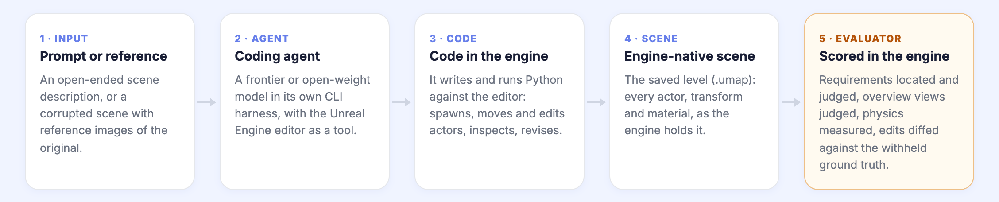
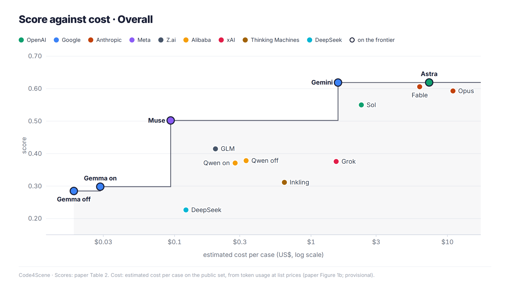

<h1 align="center">Code4Scene</h1>

<p align="center">
  <strong>Benchmarking Coding Agents for Constructing and Editing 3D Scenes</strong>
</p>

<p align="center">
  <a href="https://simworld-ai-code4scene.static.hf.space">
    
  </a>
  <a href="https://huggingface.co/spaces/SimWorld-AI/Code4Scene">
    
  </a>
  
  <a href="https://join.slack.com/t/simworld-ai/shared_invite/zt-3v3xsbroz-ELkLT3rOK1rCStDxRKUYKw">
    
  </a>
  <br />
  
  
  <a href="LICENSE"></a>
  <a href="https://github.com/SimWorld-AI/Code4Scene/stargazers">
    
  </a>
</p>

<p align="center">
  160 text-to-scene tasks and 160 image-to-scene tasks in Unreal Engine. Coding agents write and run code that builds a scene
  from text, or repairs one from reference images, and Code4Scene scores the engine-native scene they save.
</p>

<p align="center">
  <a href="https://simworld-ai-code4scene.static.hf.space/#leaderboard">Leaderboard</a> ·
  <a href="https://simworld-ai-code4scene.static.hf.space/cases.html">Cases in 3D</a> ·
  <a href="#quick-start">Quick Start</a> ·
  <a href="docs/SCORING.md">Scoring</a> ·
  <a href="#citation">Citation</a>
</p>

---

## Overview

Coding agents can now operate 3D engines: they write and run code, inspect the result and revise the scene. Code4Scene evaluates them in
Unreal Engine on two complementary settings under one shared execution interface. It does not score the code or a rendered image. It
scores the **engine-native scene** (`.umap`) the agent saves, on task fulfilment, artifact integrity and static physical validity, and it
compares edits against withheld ground truth.

<p align="center">
  
</p>

| Setting | The agent gets | The agent must | Case score | Benchmark tasks |
|:--|:--|:--|:--|:-:|
| **Text-to-Scene** · construction | An empty level, an open-ended scene description and the pack's asset catalog | Build the scene the prompt describes. Many realizations are valid. | 0.2 · Detailed Alignment + 0.6 · Overview Alignment + 0.2 · Physical Safety | 160 |
| **Image-to-Scene** · editing | A corrupted copy of a human-assembled scene and reference views of the original | Restore every target actor (within 5 cm · 5° · 5%) and change nothing else | 0.8 · Repair F1 + 0.2 · Physical Safety | 160 |

The model score is `0.5 · S_T2S + 0.5 · S_I2S`. [docs/SCORING.md](docs/SCORING.md) gives every verifier, formula and zero rule.

---

## Leaderboard

The paper evaluated 190 cases (30 Text-to-Scene + 160 Image-to-Scene). The results below are from that evaluation.

14 coding-agent configurations on the paper's original 95-case public subset (Table 2). 🔓 marks open weights. The
[interactive leaderboard](https://simworld-ai-code4scene.static.hf.space/#leaderboard) adds the sub-scores, cost per case and a
score-against-cost chart; the [cases page](https://simworld-ai-code4scene.static.hf.space/cases.html) shows each agent's saved scene in 3D
next to the evaluator's scores.

| # | Agent configuration | Provider | Overall | Text-to-Scene | Image-to-Scene |
|:-:|:--|:--|:-:|:-:|:-:|
| 1 | GPT-6 Astra (max) | OpenAI | **0.619** | 0.724 | 0.515 |
| 1 | Gemini 3.8 Flash (high) | Google | **0.619** | 0.657 | **0.581** |
| 3 | Claude Fable 5.1 (max) | Anthropic | 0.606 | **0.788** | 0.424 |
| 4 | Claude Opus 5 (max) | Anthropic | 0.593 | 0.718 | 0.468 |
| 5 | GPT-5.6 Sol (high) | OpenAI | 0.550 | 0.707 | 0.393 |
| 6 | Muse Spark 1.3 (medium) | Meta | 0.502 | 0.646 | 0.358 |
| 7 | GLM-5.3 Flash (max) 🔓 | Z.ai | 0.415 | 0.509 | 0.320 |
| 8 | Qwen 3.8 27B (thinking off) 🔓 | Alibaba | 0.378 | 0.557 | 0.200 |
| 9 | Grok 4.6 (high) | xAI | 0.376 | 0.567 | 0.184 |
| 10 | Qwen 3.8 27B (thinking on) 🔓 | Alibaba | 0.371 | 0.516 | 0.226 |
| 11 | Inkling (high) | Thinking Machines | 0.312 | 0.425 | 0.198 |
| 12 | Gemma 4 31B (thinking on) 🔓 | Google | 0.298 | 0.471 | 0.126 |
| 13 | Gemma 4 31B (thinking off) 🔓 | Google | 0.285 | 0.455 | 0.115 |
| 14 | DeepSeek V4.1 Flash (high) 🔓 | DeepSeek | 0.227 | 0.243 | 0.210 |

<p align="center">
  
  <br />
  <sub>Overall score against estimated cost per case. The line is the frontier: no agent left of it scores higher. Cost is estimated from
  token usage at list prices and is provisional.</sub>
</p>

---

## Key Findings

- 🧭 **Construction and editing probe different capabilities**: scene-level spatial reasoning and precise control of scene state. Despite
  nearly identical overall scores, Astra is stronger at construction and Gemini at editing.
- 🧩 **Spatial Composition remains the weakest requirement family for all 14 agents.** Errors persist even when the required objects are
  present: generating the right objects does not ensure that their relationships satisfy the specification.
- 🔧 **Editing ability varies substantially across repair types.** Astra performs best on Transform repairs, while Gemini is stronger on
  Lifecycle and Layout operations.
- 🎯 **Recovering the target does not guarantee precise editing.** Across all 14 configurations, 35.8% of complete recoveries still contain
  unintended changes to the surrounding scene.

---

## What's in this repository

This repository currently includes **20 Text-to-Scene and 75 Image-to-Scene task definitions**. The release target is **139 + 152**;
the remaining **21 + 8** benchmark tasks are in preparation.

| | |
|---|---|
| `code4scene/` | The verifiers and the paper's scoring protocol, as a Python package with a `code4scene` CLI. |
| `benchmark/public/` | Task definitions: prompts, requirement bundles, edit recipes, reference-view cameras and content fingerprints. |
| `benchmark/packs.yaml`, `docs/PACKS.md` | Where to get each Unreal Engine content pack the public set uses (Fab links). |
| `dataset_builder/`, `docs/BUILD_DATASET.md` | A builder that recreates the public dataset from those packs on a stock Unreal Engine 5.8 editor, then verifies it against the fingerprints. |

The paper's private set is not included.

### No third-party content is distributed

The scenes are built from third-party content packs sold or given away on [Fab](https://www.fab.com). This repository ships none of them.
It contains no levels, meshes, textures or rendered images, and no transform-level description of any seller's scene. You obtain each pack
from its original listing under its own license, then run the builder. The builder recreates:

- the ground-truth levels from the packs' own demo maps;
- the corrupted input levels, from small edit recipes;
- the reference views.

A content fingerprint confirms that your build matches the levels the benchmark was scored on, and tells you which actors differ if it does
not.

---

## Quick Start

### 1. Install

```bash
pip install -e .            # Python ≥ 3.10; add [dev] for the test suite
code4scene --help
```

### 2. Build the public dataset

1. Create an empty UE 5.8 project.
2. Install the packs listed in [docs/PACKS.md](docs/PACKS.md).
3. Run the builder from the repository root:

```bash
export UE_EDITOR=/path/to/UE_5.8/Engine/Binaries/Linux/UnrealEditor-Cmd   # or pass --editor
python -m dataset_builder.build --project /path/Code4SceneData/Code4SceneData.uproject \
    --dataset ./code4scene-dataset --steps check blank gt inputs verify package
python -m dataset_builder.build --project ... --dataset ./code4scene-dataset --steps render   # reference views, needs a GPU
```

[docs/BUILD_DATASET.md](docs/BUILD_DATASET.md) covers disk and time estimates, the verification report, and scene-specific notes.

> **Keep the answers away from agents.** An agent under test may only see `code4scene-dataset/agent/` (task prompts,
> case facts and reference views). Never give it this repository's `benchmark/` directory, `code4scene-dataset/scorer/`,
> `snapshots/` or the `Code4SceneGT` content, including through a shell or file tool: they contain the answers.

### 3. Score a scene

The verifiers read an **evidence bundle**: scene snapshots, physics measurements and renders, exported from the saved level by the editor
scripts in `code4scene/ue_scripts/`. See [docs/EVIDENCE_BUNDLE.md](docs/EVIDENCE_BUNDLE.md).

```bash
code4scene score path/to/bundle --task benchmark/public/<setting>/<case>/task.yaml   # full scoring (needs the VLM judge)
code4scene score path/to/bundle --task .../task.yaml --no-vlm                      # structured leaves only
code4scene aggregate scores/ --schedule benchmark --format csv -o model-scores.csv  # case scores → model score
```

Text-to-Scene semantic and overview judgments use a VLM judge. The paper used **Qwen3.8-27B**; point the CLI at your own
OpenAI-compatible deployment with `CODE4SCENE_VLM_BASE_URL` and `CODE4SCENE_VLM_MODEL`.

Scores are comparable to the paper's only when agents run under the same interface, asset catalog and budget.

---

## Tests

```bash
pip install -e ".[dev]" && pytest     # quote the extra in zsh
```

The suite runs fully offline.

---

## License

The code is released under the Apache License 2.0 ([LICENSE](LICENSE)). The content packs are not part of this repository and remain under their
own Fab licenses.

---

## Citation

```bibtex
@article{code4scene2026,
  title   = {Code4Scene: Benchmarking Coding Agents for Constructing and Editing 3D Scenes},
  author  = {Ye, Xiaokang and Mantri, Siddhant Hitesh and Chen, Zimeng and Zhang, Edward and Zheng, Zhaoxu and Li, Yuanheng and Chen, Yizhao and Huang, Tianyang and Qin, Lianhui},
  year    = {2026}
}
```

<p align="center">
  <sub>Part of the <a href="https://simworld.org">SimWorld</a> project.</sub>
</p>
